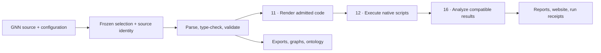

# Generalized Notation Notation (GNN)

**Describe an Active Inference generative model once. Validate its structure,
render framework-specific code, execute admitted models and inspect the evidence.**

[](https://github.com/ActiveInferenceInstitute/Generalized_Notation_Notation/releases/tag/v4.0.1)
[](https://github.com/ActiveInferenceInstitute/Generalized_Notation_Notation/actions/workflows/ci.yml)
[](workflows/ci.yml)
[](../LICENSE.md)


*The GNN 4.0.0 release artwork illustrates the current-run contracts carried
forward in the latest maintenance release, **4.0.1**.*

[Quick start](#quick-start) · [Examples](#choose-a-model) ·
[Backends](#render-and-execute-backends) · [Documentation](#documentation-map) ·
[Release & paper](#release-artifacts-and-citation) · [Roadmap](#next-steps) ·
[Contribute](#contributing-and-support)

GNN is a human-readable, machine-parsable **Markdown notation** for
[Active Inference](https://activeinference.org/) generative models. This
repository provides the notation, curated model sources and a **25-step
scientific workflow** spanning parsing, validation, visualization, simulation,
analysis and publication. Researchers can inspect model assumptions in text;
developers can use the installed `gnn` Python package, CLI and service interfaces.

**Current release:** [GNN 4.0.1](https://github.com/ActiveInferenceInstitute/Generalized_Notation_Notation/releases/tag/v4.0.1).
**Page updated:** 2026-10-07. Package metadata is canonical in
[pyproject.toml](../pyproject.toml); release history is in [CHANGELOG.md](../CHANGELOG.md).

## What GNN 4 delivers

- **Readable model specifications.** Declare state spaces, connections,
  parameters, equations, time and ontology annotations. Maintain categorical
  POMDP and linear-Gaussian models with explicit model-kind admission.
- **Validation before simulation.** Check shapes, probabilities, covariance
  assumptions and declared scientific contracts; retain actionable failure and
  unsupported outcomes.
- **Framework-specific rendering and execution.** Step 11 generates code;
  Step 12 supervises native scripts. Optional packages and toolchains are
  installed for the selected backend and model contract.
- **Evidence tied to one invocation.** Frozen selection, path-derived model
  identities, source hashes, resolved configuration, artifact indexes, output
  leases and a shared deadline bind the current run. Required unfinished work
  prevents success. Read the [v4 migration guide](../docs/development/run_ownership_migration.md).
- **Scientific analysis and communication.** Produce graphs, matrix views,
  statistics, reports and static websites. Numerical comparisons require
  compatible source identities, inference semantics, inputs and precision;
  Gaussian uncertainty is derived from covariance.
- **Interfaces for people and tools.** Use CLI, REST, MCP, editor/LSP and GUI
  surfaces, with optional LLM analysis, audio and ML integrations. Durable run
  manifests, resumable acceptance sessions and auditable container plans support
  longer workflows.

The **4.0.1 maintenance patch** improves GUI parsing complexity, locked dependency
security, complete subprocess input delivery and LLM coverage diagnostics. Its
[publication receipt](../docs/development/gnn_4_0_1_post_publication.json) records
accepted source/tag identities, companion checks and verified release artifacts.
Full-source long-context LLM completion and broader scientific semantics remain
scoped in the [forward roadmap](../TO-DO.md).

## Start here

| Your goal | Best starting point |
| --- | --- |
| Run a first model | [Quick start below](#quick-start), then the [setup guide](../SETUP_GUIDE.md) |
| Write or understand GNN | [Language hub](../docs/gnn/language/README.md), [syntax reference](../docs/gnn/reference/gnn_syntax.md), [examples tutorial](../docs/gnn/tutorials/gnn_examples_doc.md) |
| Choose a scientific example | [Exemplar index](../input/gnn_files/INDEX.md) and [model-family manifest](../input/model_family_manifest.json) |
| Integrate a backend or interface | [Backend guide](../docs/gnn/integration/framework_integration_guide.md), [architecture](../ARCHITECTURE.md), [interface map](#interfaces) |
| Inspect the release or paper | [Release artifacts and citation](#release-artifacts-and-citation) |
| Contribute a focused improvement | [TO-DO.md](../TO-DO.md), [CONTRIBUTING.md](../CONTRIBUTING.md), [AGENTS.md](../AGENTS.md) |

## Quick start

Install [uv](https://docs.astral.sh/uv/getting-started/installation/) and use
Python **3.12** for this example. CI also runs Python 3.11 and 3.13; additional
platform/runtime acceptance is tracked in [TO-DO.md](../TO-DO.md).

### Install the released source

```bash
git clone --branch v4.0.1 --depth 1 https://github.com/ActiveInferenceInstitute/Generalized_Notation_Notation.git
cd Generalized_Notation_Notation
uv sync --frozen --python 3.12
```

### Inspect one model

```bash
uv run --frozen gnn validate input/gnn_files/discrete/two_state_bistable.md --strict
uv run --frozen gnn extract input/gnn_files/discrete/two_state_bistable.md --compact
```

Validation reports **12 variables and 11 connections** for this committed
example. Extraction returns its two states, two observations, two actions and
source-declared parameters as structured JSON.

### Run a small local workflow

```bash
uv run --frozen gnn run \
  --target-dir input/gnn_files/basics \
  --output-dir output/quickstart \
  --only-steps 3 5 6 7 8 \
  --skip-steps 0 1 2
```

This example parses, type-checks, validates, exports and visualizes the basic
models. `--target-dir` takes a **directory**; `validate` and `extract` take a
**file**. Pipeline prerequisites are resolved by the orchestrator. Each new run
gets its own identity; inspect its summary and artifacts under the selected
output directory.

For simulation, use the [full quick-start guide](../docs/quickstart.md) and
[backend setup](../SETUP_GUIDE.md). The full workflow can include native
frameworks, Julia/Stan toolchains, GUI/audio and configured LLM providers;
provision those dependencies and resource budgets for the steps you select.
Configuration starts in [input/config.yaml](../input/config.yaml). LLM work
reports coverage and context refusals; completion is accepted only for the
source/prompt requests actually executed.

## From model source to evidence

A GNN model names its variables and dimensions, connects them and declares
parameters separately. This **excerpt** comes from the
[complete two-state model](../input/gnn_files/discrete/two_state_bistable.md):

```markdown
## StateSpaceBlock
A[2,2,type=float]       # Likelihood: observations × hidden states
s[2,1,type=float]       # State belief
o[2,1,type=int]         # Observation

## Connections
s-A
A-o

## InitialParameterization
A={
  (0.8, 0.2),
  (0.2, 0.8)
}
```

The diagram is a conceptual workflow; the
[architecture guide](../ARCHITECTURE.md) and [module registry](../AGENTS.md)
document the actual artifact dependencies and step prerequisites.



Inputs live in [input/gnn_files/](../input/gnn_files/). Generated artifacts live
under the selected output directory; the repository's committed [output/](../output/)
contains publication evidence with its own recorded provenance. Consult the
current run summary before treating an artifact as evidence for a new run.

## Choose a model

| Model family or question | Example sources and guidance |
| --- | --- |
| Learn the notation | [Static perception](../input/gnn_files/basics/static_perception.md), [dynamic perception](../input/gnn_files/basics/dynamic_perception.md) |
| Minimal categorical agent | [Two-state bistable POMDP](../input/gnn_files/discrete/two_state_bistable.md), [simple MDP](../input/gnn_files/discrete/simple_mdp.md) |
| GridWorld and framework comparison | [GridWorld folder](../input/gnn_files/pomdp_gridworld/README.md) |
| Linear-Gaussian dynamics and control | [Continuous navigation](../input/gnn_files/continuous/continuous_navigation.md), [damped oscillator](../input/gnn_files/continuous/damped_oscillator_bias.md) |
| Explicit independent Gaussian agents | [Independent-agent exemplar](../input/gnn_files/continuous/independent_gaussian_agents.md); admitted native JAX/RxInfer contracts |
| Hierarchy and epistemic policies | [Block-reset hierarchy](../input/gnn_files/hierarchical/hierarchical_pomdp.md), [temporal controller](../input/gnn_files/hierarchical/temporal_hierarchy.md), [episodic T-maze](../input/gnn_files/discrete/tmaze_epistemic.md); explicit JAX contracts |
| Learning, precision and multi-agent models | [Full exemplar index](../input/gnn_files/INDEX.md), [cognitive phenomena](../docs/cognitive_phenomena/README.md) |
| Scaling studies | [PyMDP scaling examples](../input/gnn_files/pymdp_scaling_study/README.md); compare matched run receipts |

An exemplar's declared contract determines backend admission. Composed,
nonstationary and coupled models have specific supported/unsupported outcomes;
the [family manifest](../input/model_family_manifest.json) and
[scientific acceptance receipt](../docs/development/issue250_scientific_acceptance_2026_10_07.json)
record the selected cases and numerical evidence.

## Render and execute backends

The [renderer registry](../src/gnn/render/framework_registry.py) and
[executor specifications](../src/gnn/execute/executor_specs.py) describe the
maintained implementations. Generator availability, installed native
dependencies, model admission and numerical acceptance are separate checks.

| Backend | Scope and setup reference |
| --- | --- |
| [PyMDP](../docs/gnn/implementations/pymdp.md) | Categorical POMDP/MDP inference and action selection |
| [JAX](../docs/gnn/implementations/jax.md) | Admitted categorical and linear-Gaussian models, plus explicitly declared scientific/composed contracts |
| [RxInfer.jl](../docs/gnn/implementations/rxinfer.md) | Julia message-passing implementations for admitted categorical and Gaussian contracts |
| [ActiveInference.jl](../docs/gnn/implementations/activeinference_jl.md) | Julia categorical Active Inference |
| [PyTorch](../docs/gnn/implementations/pytorch.md), [NumPyro](../docs/gnn/implementations/numpyro.md), [Stan](../docs/gnn/implementations/stan.md) | Framework-specific categorical and linear-Gaussian render/execute paths; install the corresponding package/toolchain |
| [DisCoPy](../docs/gnn/implementations/discopy.md), [bnlearn](../docs/bnlearn/README.md) | Categorical diagrams and Bayesian-network workflows under their adapter contracts |
| [ngc-learn](../src/gnn/render/ngclearn/README.md) | Continuous linear-Gaussian/predictive-coding contract; see the adapter's model admission |
| [cpomdp](../docs/gnn/implementations/cpomdp.md) | Explicitly selected experimental released-wheel continuous backend, with bounded policy/resource options and numerical witnesses |
| [THRML](../docs/gnn/implementations/thrml.md) | Explicitly selected experimental finite categorical Gibbs smoothing under fixed actions, using released `thrml==0.1.4` |

THRML admits strictly positive models; structural zeros, continuous models,
cross-agent coupling and action optimization are outside its current contract.
Native sample witnesses support the reported empirical marginals; convergence,
exact inference and hardware execution require separate evidence.

See the [implementation index](../docs/gnn/implementations/README.md) for complete
adapter documentation and [setup guide](../SETUP_GUIDE.md) for optional extras
and Julia environments. [CatColab](../docs/gnn/implementations/catcolab.md) is
covered in the related modeling documentation.

## Pipeline: all 25 steps

Numbered scripts in [src/gnn/](../src/gnn/) delegate to their module owners.
Use selected steps for a focused task or the full pipeline for a provisioned
workflow. The [module documentation index](../docs/gnn/modules/README.md) and
[root AGENTS guide](../AGENTS.md) provide implementation details.

<details>
<summary>Expand the complete step map (0–24)</summary>

| Step | Module guide | Purpose |
| ---: | --- | --- |
| 0 | [Template](../docs/gnn/modules/00_template.md) | Initialize the pipeline |
| 1 | [Setup](../docs/gnn/modules/01_setup.md) | Inspect/setup dependencies |
| 2 | [Tests](../docs/gnn/modules/02_tests.md) | Execute test selections |
| 3 | [GNN](../docs/gnn/modules/03_gnn.md) | Discover and parse selected sources |
| 4 | [Model registry](../docs/gnn/modules/04_model_registry.md) | Model metadata and versioning |
| 5 | [Type checker](../docs/gnn/modules/05_type_checker.md) | Dimensions, types and resource estimates |
| 6 | [Validation](../docs/gnn/modules/06_validation.md) | Semantic and consistency checks |
| 7 | [Export](../docs/gnn/modules/07_export.md) | Generate exchange formats |
| 8 | [Visualization](../docs/gnn/modules/08_visualization.md) | Graph and matrix views |
| 9 | [Advanced visualization](../docs/gnn/modules/09_advanced_viz.md) | Additional plots and interactive artifacts |
| 10 | [Ontology](../docs/gnn/modules/10_ontology.md) | Map model terms to ontology concepts |
| 11 | [Render](../docs/gnn/modules/11_render.md) | Generate admitted backend code |
| 12 | [Execute](../docs/gnn/modules/12_execute.md) | Supervise native simulation scripts |
| 13 | [LLM](../docs/gnn/modules/13_llm.md) | Configured model interpretation and analysis |
| 14 | [ML integration](../docs/gnn/modules/14_ml_integration.md) | Machine-learning integrations |
| 15 | [Audio](../docs/gnn/modules/15_audio.md) | Sonification and audio artifacts |
| 16 | [Analysis](../docs/gnn/modules/16_analysis.md) | Statistics and source-compatible comparison |
| 17 | [Integration](../docs/gnn/modules/17_integration.md) | Coordinate cross-module outputs |
| 18 | [Security](../docs/gnn/modules/18_security.md) | Security validation and access controls |
| 19 | [Research](../docs/gnn/modules/19_research.md) | Research tooling and experimental features |
| 20 | [Website](../docs/gnn/modules/20_website.md) | Publish static run views |
| 21 | [MCP](../docs/gnn/modules/21_mcp.md) | Discover and expose model tools |
| 22 | [GUI](../docs/gnn/modules/22_gui.md) | Headless artifacts and interactive editors |
| 23 | [Report](../docs/gnn/modules/23_report.md) | Assemble current-run reports |
| 24 | [Intelligent analysis](../docs/gnn/modules/24_intelligent_analysis.md) | Summarize the current run |

</details>

## Interfaces

| Surface | Entry point and documentation |
| --- | --- |
| Python | Installed `gnn.*` package; [API reference](../docs/api/README.md) |
| CLI | `gnn`; [commands and exit codes](../src/gnn/cli/README.md) |
| REST | `gnn serve`; [service guide](../src/gnn/api/AGENTS.md) |
| MCP | `gnn mcp list` / `gnn mcp info`; [transport guide](../docs/gnn/mcp/README.md), [tool reference](../docs/gnn/mcp/tool_reference.md) |
| Editor/LSP | `gnn lsp`; [LSP guide](../src/gnn/lsp/README.md) |
| GUI | `gnn gui`; [GUI guide](../src/gnn/gui/README.md) |
| Templates | `gnn templates list` / `gnn pull`; [template documentation](../docs/templates/README.md) |

## Documentation map

| Read next | What it covers |
| --- | --- |
| [Guided start](../docs/START_HERE.md), [learning paths](../docs/learning_paths.md) | Onboarding for researchers and developers |
| [GNN documentation hub](../docs/gnn/README.md), [DOCS.md](../DOCS.md) | Language, pipeline and integration maps |
| [Syntax](../docs/gnn/reference/gnn_syntax.md), [schema](../docs/gnn/reference/gnn_schema.md), [type system](../docs/gnn/reference/gnn_type_system.md) | Model authoring and interpretation |
| [Architecture](../ARCHITECTURE.md), [SPEC.md](../SPEC.md) | Implementation boundaries and declared behavior |
| [Setup](../SETUP_GUIDE.md), [operations](../docs/gnn/operations/gnn_tools.md), [troubleshooting](../docs/gnn/operations/gnn_troubleshooting.md) | Installation, commands and diagnosis |
| [Active Inference](../docs/active_inference/README.md), [cognitive models](../docs/cognitive_phenomena/README.md) | Scientific background and example domains |
| [Testing guide](../docs/gnn/testing/README.md), [verification commands](../TO-DO.md#verification-and-execution-rules) | Acceptance and reproducibility |
| [Durable runs](../docs/development/durable-runs.md), [orchestration contracts](../docs/pipeline/v3_orchestration.md) | Manifests, resumption and container plans |
| [FEP/GEO paired revisions](../docs/development/fep_lean_paired_revision.md) | Cross-repository custody and coordinated owner changes |

## Release artifacts and citation

The [4.0.1 release](https://github.com/ActiveInferenceInstitute/Generalized_Notation_Notation/releases/tag/v4.0.1)
contains the wheel, source distribution, manuscript, source-binding and
verification receipts, plus [SHA256SUMS](https://github.com/ActiveInferenceInstitute/Generalized_Notation_Notation/releases/download/v4.0.1/SHA256SUMS).
Read the [published manuscript PDF](https://github.com/ActiveInferenceInstitute/Generalized_Notation_Notation/releases/download/v4.0.1/GNN-4.0.1-manuscript.pdf)
and [publication receipt](../docs/development/gnn_4_0_1_post_publication.json)
for the accepted release epoch. Main may contain subsequent documentation work;
release artifacts retain their original source and tag identities.

For academic use, follow [CITATION.cff](../CITATION.cff). The initial publication
is **Smékal, J., & Friedman, D. A. (2023), _Generalized Notation Notation for
Active Inference Models_, Active Inference Journal**. The
[project concept DOI](https://doi.org/10.5281/zenodo.7803313) and
[historical archive](https://zenodo.org/records/7803328) are distinct from a
version-specific archive. Exact-version archival work is tracked under E5 in
[TO-DO.md](../TO-DO.md#minor-work).

The repository is maintained by the
[Active Inference Institute](https://activeinference.org/) community and licensed
under [CC BY-NC-SA 4.0](../LICENSE.md).

## Next steps

The [forward-only roadmap](../TO-DO.md) defines scope, priority, acceptance evidence
and dependencies for each remaining workstream. Effort size and release version
are separate decisions.

| Effort | Upcoming scope |
| --- | --- |
| [Minor](../TO-DO.md#minor-work) | Documentation, diagnostics/dependency ratchets, released THRML fix verification, scientific presentation and archival publication |
| [Medium](../TO-DO.md#medium-work) | Module ownership, execution/interface contracts, filesystem/platform boundaries, meaningful coverage, measured performance and installed-package acceptance |
| [Major](../TO-DO.md#major-work) | Full-source long-context LLM processing, coupled continuous agents, THRML/cpomdp extensions and formal-to-numerical semantics |

## Contributing and support

Start with [CONTRIBUTING.md](../CONTRIBUTING.md) and the
[agent/contributor guide](../AGENTS.md). Propose focused changes with a source
baseline and acceptance evidence; use current CI for test outcomes and timings.

- [Issues](https://github.com/ActiveInferenceInstitute/Generalized_Notation_Notation/issues): reproducible bugs and scoped work.
- [Discussions](https://github.com/ActiveInferenceInstitute/Generalized_Notation_Notation/discussions): modeling questions and ideas.
- [SUPPORT.md](../SUPPORT.md): help and community channels.
- [SECURITY.md](../SECURITY.md): vulnerability reporting.
- [CODE_OF_CONDUCT.md](../CODE_OF_CONDUCT.md): participation standards.
- [Contributors](https://github.com/ActiveInferenceInstitute/Generalized_Notation_Notation/graphs/contributors): contribution history.

## Repository and automation guide

| Path | Role |
| --- | --- |
| [src/gnn/](../src/gnn/) | Installed Python package, numbered orchestrators and module implementations |
| [input/](../input/) | Model sources, family manifest and configuration |
| [output/](../output/) | Committed publication artifacts and recorded provenance |
| [tests/](../tests/) | Behavior, contract and integration checks |
| [docs/](../docs/) | Language, framework, scientific and operator guides |
| [scripts/](../scripts/) | Audits, acceptance tools and publication tooling |
| [pyproject.toml](../pyproject.toml), [uv.lock](../uv.lock) | Package metadata and locked dependencies |
| [Root README](../README.md) | Extended project narrative and examples |

<details>
<summary>Maintainer reference: .github files, workflows and local checks</summary>

### Automation in this folder

[AGENTS.md](AGENTS.md) defines folder guardrails; [SPEC.md](SPEC.md) defines its
purpose. [workflows/README.md](workflows/README.md) documents triggers and exact
workflow commands, with [workflow AGENTS](workflows/AGENTS.md) and
[SPEC](workflows/SPEC.md) for maintainers. Dependabot configuration is in
[dependabot.yml](dependabot.yml); CodeQL configuration is in
[codeql/codeql-config.yml](codeql/codeql-config.yml).

### Workflow index

| Workflow or configuration | Purpose |
| --- | --- |
| [ci.yml](workflows/ci.yml) | Python 3.11/3.12/3.13 tests; 3.12 lint/types/docs/capability checks; pipeline contracts; optional-dependency and Bandit lanes |
| [local-gates.yml](workflows/local-gates.yml) | Repository, manuscript-token and hydration gates |
| [docs-audit.yml](workflows/docs-audit.yml) | Focused strict documentation and terminology audits |
| [mcp-audit.yml](workflows/mcp-audit.yml) | MCP inventory regression gate |
| [codeql.yml](workflows/codeql.yml) | Python security analysis |
| [dependency-review.yml](workflows/dependency-review.yml) | PR dependency/license review; [fork limitations](https://docs.github.com/en/code-security/supply-chain-security/understanding-your-software-supply-chain/about-dependency-review#dependency-review-for-forked-repositories) |
| [supply-chain-audit.yml](workflows/supply-chain-audit.yml) | Scheduled vulnerability checks on locked exports |
| [full-extras.yml](workflows/full-extras.yml) | Scheduled/manual all-extras installation and acceptance |
| [gridworld.yml](workflows/gridworld.yml) | GridWorld publication checks |
| [actionlint.yml](workflows/actionlint.yml) | Workflow YAML validation |
| [fep-lean-paired-revision.yml](workflows/fep-lean-paired-revision.yml), [fep-lean-pair.json](fep-lean-pair.json) | Pinned FEP bridge custody checks |
| [geo-infer-interchange.yml](workflows/geo-infer-interchange.yml), [gnn-pair.json](gnn-pair.json) | Pinned GEO interchange checks |
| [pair-pin-freshness.yml](workflows/pair-pin-freshness.yml) | Scheduled companion-pin freshness checks |
| [custody-re-render.yml](workflows/custody-re-render.yml) | Scheduled/manual fresh manuscript-render audit |

CI runs on documentation PRs too. Documentation, paired-custody, security and
repository gates provide complementary evidence. Exact selections, environment
requirements, schedules and permission scopes live in the workflow files.

### Local validation

From a development checkout on `main`, install the locked development tools,
then run the documentation checks appropriate to this page:

```bash
uv sync --frozen --extra dev --python 3.12
uv run --frozen --no-sync python docs/development/docs_audit.py --strict --check-anchors --no-write
uv run --frozen --no-sync python scripts/check_doc_contracts.py --strict
uv run --frozen --no-sync python scripts/check_repo_terminology.py --strict
uv run --frozen --no-sync python scripts/check_maintained_doc_terms.py --strict
uv run --frozen --no-sync python scripts/check_gnn_doc_patterns.py --strict
uv run --frozen --no-sync python scripts/check_capability_contracts.py --strict
```

For source changes use the [current verification commands](../TO-DO.md#verification-and-execution-rules)
and the workflows' declared environments. Run `actionlint .github/workflows/*.yml`
when workflow YAML changes. Count-changing manuscript/source/test edits follow
the full rendering/custody procedure in [AGENTS.md](../AGENTS.md).

</details>
