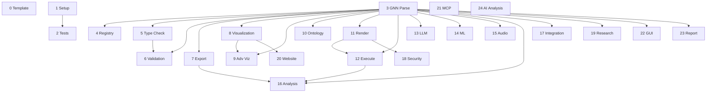

# GNN Pipeline Step Index

**Version**: [pyproject.toml](../../pyproject.toml) (canonical · 4.0.0) · **Last Updated**: 2026-10-05 · **Total Steps**: 25 (0–24)

---

## Configuration

The immutable run context freezes model identity, source hashes, selected steps,
frameworks, resolved configuration and the run deadline before dispatch. The
[`step registry`](pipeline/step_registry.py) declares each step's execution scope
and hard prerequisites; serial, parallel and consolidated execution use that
selection. An explicit empty **model selection** suppresses model discovery
and processing; selected run/environment steps (such as 1, 2 and 21) can still
perform their run-scoped work. Standalone model processors may discover sources
when no model selection context is supplied.

[`input/config.yaml`](../../input/config.yaml) supplies the testing matrix:

- Steps 0, 1 and 2 have independent `testing_matrix.global_steps` toggles.
- `source` and `artifacts` processing steps use the selected folder/input view.
  Folder rules constrain the frozen model manifest; documentation-only and
  archived sources receive explicit exclusion receipts.
- `corpus` steps 0, 13, 16, 17, 20 and 22 run once for their selected corpus.
  `run` steps 1, 2, 21, 23 and 24 run once per invocation.
- The shipped matrix has `folders: {}` and `default_steps: [3–12, 14–24]`.
  Steps 0, 13 and 22 retain corpus selection independently of folder-list
  membership; run-scoped consumers are never dispatched once per folder.
  Disable LLM processing with `pipeline.skip_steps: [13]` or `--skip-llm`.

> See [`SPEC.md`](SPEC.md) for full matrix configuration documentation.
> For the maintained hardening goal, stage-by-stage operating contract, and
> GridWorld end-to-end proof path, see
> [`docs/pipeline/pipeline_stage_hardening_review.md`](../../docs/pipeline/pipeline_stage_hardening_review.md).

---

## Master Step Table

| Step | Script | Module Dir | Phase | Purpose | Input | Output Dir | Has MCP | AGENTS.md | README | SPEC.md | Frameworks | Exit Codes | Timeout (s) | Prerequisites | Recovery Behavior | Data Flow | Execution Scope | Criticality | Category |
|:----:|--------|-----------|-------|---------|-------|------------|:-------:|:---------:|:------:|:-------:|------------|:----------:|:-----------:|--------------|-------------------|-----------|:-------------:|-------------|----------|
| 0 | [`0_template.py`](0_template.py) | [`template/`](template/) | Global | Pipeline template & initialization | Selected model sources and resolved configuration | `0_template_output/` | ✅ | [✅](template/AGENTS.md) | [✅](template/README.md) | [✅](template/SPEC.md) | — | 0, 1, 2 | 180 | None | N/A | Produces pipeline metadata | `corpus` (once per corpus) | Low | Infrastructure |
| 1 | [`1_setup.py`](1_setup.py) | [`setup/`](setup/) | Global | Environment setup & UV dependency install | `pyproject.toml` | `1_setup_output/` | ✅ | [✅](setup/AGENTS.md) | [✅](setup/README.md) | [✅](setup/SPEC.md) | — | 0, 1, 2 | 180 | None | Skips optional deps gracefully | Produces `.venv/` | `run` (once per run) | High | Infrastructure |
| 2 | [`2_tests.py`](2_tests.py) | [`tests/`](../../tests/) | Global | Test suite execution (pytest) | `tests/` | `2_tests_output/` | ✅ | [✅](../../tests/AGENTS.md) | [✅](../../tests/README.md) | [✅](../../tests/SPEC.md) | — | 0, 1, 2 | 900 | Step 1 | Reports failures, continues | Produces test reports | `run` (once per run) | Medium | Quality |
| 3 | [`3_gnn.py`](3_gnn.py) | [`gnn/`](.) | Core | GNN file discovery & multi-format parsing | Frozen selected model sources | `3_gnn_output/` | ✅ | [✅](AGENTS.md) | [✅](README.md) | [✅](SPEC.md) | — | 0, 1, 2 | 300 | None | Logs parse errors per file | Complete current-run parse index and model artifacts | `source` (selected input view) | Critical | Processing |
| 4 | [`4_model_registry.py`](4_model_registry.py) | [`model_registry/`](model_registry/) | Core | Model versioning & registry management | Selected GNN model sources | `4_model_registry_output/` | ✅ | [✅](model_registry/AGENTS.md) | [✅](model_registry/README.md) | [✅](model_registry/SPEC.md) | — | 0, 1, 2 | 180 | Step 3 | Creates registry with available data | Model registry artifacts | `source` (selected input view) | Medium | Processing |
| 5 | [`5_type_checker.py`](5_type_checker.py) | [`type_checker/`](type_checker/) | Core | GNN type validation & resource estimation | Selected GNN model sources | `5_type_checker_output/` | ✅ | [✅](type_checker/AGENTS.md) | [✅](type_checker/README.md) | [✅](type_checker/SPEC.md) | — | 0, 1, 2 | 180 | Step 3 | Reports type errors, continues | Type/shape validation results | `source` (selected input view) | High | Validation |
| 6 | [`6_validation.py`](6_validation.py) | [`validation/`](validation/) | Core | Consistency & semantic quality checking | Current-run Step 3 parse artifacts and Step 5 prerequisites | `6_validation_output/` | ✅ | [✅](validation/AGENTS.md) | [✅](validation/README.md) | [✅](validation/SPEC.md) | — | 0, 1, 2 | 180 | Steps 3, 5 | Reports issues, continues | Validation results | `artifacts` (producer outputs) | High | Validation |
| 7 | [`7_export.py`](7_export.py) | [`export/`](export/) | Core | Multi-format export (JSON, XML, GraphML, GEXF, Pickle) | Current-run Step 3 parse artifacts | `7_export_output/` | ✅ | [✅](export/AGENTS.md) | [✅](export/README.md) | [✅](export/SPEC.md) | — | 0, 1, 2 | 300 | Step 3 | Exports available formats | Exported representations | `artifacts` (producer outputs) | Medium | Export |
| 8 | [`8_visualization.py`](8_visualization.py) | [`visualization/`](visualization/) | Core | Graph & matrix visualization generation | Selected sources; current-run Step 3 parsed artifacts preferred | `8_visualization_output/` | ✅ | [✅](visualization/AGENTS.md) | [✅](visualization/README.md) | [✅](visualization/SPEC.md) | matplotlib, networkx | 0, 1, 2 | 600 | Step 3 | HTML recovery if matplotlib missing | Current-run visualization index and assets | `source` (selected input view) | Low | Visualization |
| 9 | [`9_advanced_viz.py`](9_advanced_viz.py) | [`advanced_visualization/`](advanced_visualization/) | Core | Interactive / advanced visualization (Plotly, D3) | Current-run Step 3/8 artifacts | `9_advanced_viz_output/` | ✅ | [✅](advanced_visualization/AGENTS.md) | [✅](advanced_visualization/README.md) | [✅](advanced_visualization/SPEC.md) | plotly, d3 | 0, 1, 2 | 600 | Steps 3, 8 | HTML report recovery | Interactive plots | `artifacts` (producer outputs) | Low | Visualization |
| 10 | [`10_ontology.py`](10_ontology.py) | [`ontology/`](ontology/) | Analysis | Active Inference ontology processing & validation | Selected GNN model sources | `10_ontology_output/` | ✅ | [✅](ontology/AGENTS.md) | [✅](ontology/README.md) | [✅](ontology/SPEC.md) | — | 0, 1, 2 | 180 | Step 3 | Logs missing ontology terms | Ontology mappings | `source` (selected input view) | Medium | Analysis |
| 11 | [`11_render.py`](11_render.py) | [`render/`](render/) | Simulation | Code generation for simulation frameworks | Selected GNN model sources | `11_render_output/` | ✅ | [✅](render/AGENTS.md) | [✅](render/README.md) | [✅](render/SPEC.md) | PyMDP, RxInfer.jl, ActiveInference.jl, JAX, DisCoPy, PyTorch, NumPyro, Stan, bnlearn, cpomdp (experimental), THRML (experimental), ngc-learn | 0, 1, 2 | 300 | Step 3 | Generates available frameworks | Generated scripts → Step 12 | `source` (selected input view) | Critical | Code Gen |
| 12 | [`12_execute.py`](12_execute.py) | [`execute/`](execute/) | Simulation | Execute rendered simulation scripts | Current-run rendered scripts and manifest | `12_execute_output/` | ✅ | [✅](execute/AGENTS.md) | [✅](execute/README.md) | [✅](execute/SPEC.md) | PyMDP, RxInfer.jl, ActiveInference.jl, JAX, DisCoPy, PyTorch, NumPyro, Stan, bnlearn, cpomdp (experimental), THRML (experimental), ngc-learn, Lean (execution-only fep_lean bridge) | 0, 1, 2 | 7200 | Steps 3, 11 | Bounded retries; retain each successful, failed, unsupported or timed-out result | Identity-bound execution results → Step 16 | `artifacts` (producer outputs) | Critical | Simulation |
| 13 | [`13_llm.py`](13_llm.py) | [`llm/`](llm/) | Analysis | LLM-enhanced analysis & model interpretation | All selected models; optional current-run ontology/execution evidence | `13_llm_output/` | ✅ | [✅](llm/AGENTS.md) | [✅](llm/README.md) | [✅](llm/SPEC.md) | Ollama, OpenAI, OpenRouter, Perplexity | 0, 1, 2 | 600 × selected models (see budget contract) | Step 3 | Exact configured provider/model preflight; report partial coverage and checkpoint | Per-model structural analysis, summaries and checkpoints | `corpus` (once per corpus) | Low | AI |
| 14 | [`14_ml_integration.py`](14_ml_integration.py) | [`ml_integration/`](ml_integration/) | Analysis | Machine learning integration & model training | Selected GNN model sources | `14_ml_integration_output/` | ✅ | [✅](ml_integration/AGENTS.md) | [✅](ml_integration/README.md) | [✅](ml_integration/SPEC.md) | scikit-learn, torch | 0, 1, 2 | 180 | Step 3 | Skips if ML deps missing | ML model artifacts | `source` (selected input view) | Low | AI |
| 15 | [`15_audio.py`](15_audio.py) | [`audio/`](audio/) | Output | Audio sonification generation (SAPF) | Selected models; optional current-run execution telemetry | `15_audio_output/` | ✅ | [✅](audio/AGENTS.md) | [✅](audio/README.md) | [✅](audio/SPEC.md) | soundfile, pedalboard | 0, 1, 2 | 180 | Step 3 | Logs if audio deps missing | Audio files | `source` (selected input view) | Low | Creative |
| 16 | [`16_analysis.py`](16_analysis.py) | [`analysis/`](analysis/) | Analysis | Statistical analysis & cross-simulation aggregation | Selected models and current-run Step 12 execution results | `16_analysis_output/` | ✅ | [✅](analysis/AGENTS.md) | [✅](analysis/README.md) | [✅](analysis/SPEC.md) | numpy, scipy | 0, 1, 2 | 900 | Steps 3, 7, 12 | Reports per-result failures; preserves partial current-run aggregation | Per-result analysis once; corpus aggregation once | `corpus` (once per corpus) | Medium | Analysis |
| 17 | [`17_integration.py`](17_integration.py) | [`integration/`](integration/) | Output | System integration & cross-module coordination | Selected corpus and current-run artifacts | `17_integration_output/` | ✅ | [✅](integration/AGENTS.md) | [✅](integration/README.md) | [✅](integration/SPEC.md) | — | 0, 1, 2 | 300 | Step 3 | Logs integration gaps | Corpus integration report once | `corpus` (once per corpus) | Medium | Integration |
| 18 | [`18_security.py`](18_security.py) | [`security/`](security/) | Output | Security validation & generated code scanning | Selected models and generated scripts | `18_security_output/` | ✅ | [✅](security/AGENTS.md) | [✅](security/README.md) | [✅](security/SPEC.md) | — | 0, 1, 2 | 180 | Step 11 | Reports findings, continues | Security report | `source` (selected input view) | High | Quality |
| 19 | [`19_research.py`](19_research.py) | [`research/`](research/) | Output | Research tools & literature references | Selected GNN model sources | `19_research_output/` | ✅ | [✅](research/AGENTS.md) | [✅](research/README.md) | [✅](research/SPEC.md) | — | 0, 1, 2 | 180 | Step 3 | Generates with available data | Research notes | `source` (selected input view) | Low | Research |
| 20 | [`20_website.py`](20_website.py) | [`website/`](website/) | Output | Static HTML website generation | Current-run visualization and optional execution/analysis artifacts | `20_website_output/` | ✅ | [✅](website/AGENTS.md) | [✅](website/README.md) | [✅](website/SPEC.md) | jinja2 | 0, 1, 2 | 180 | Step 8 | Minimal HTML if deps missing | One current-run website build | `corpus` (once per corpus) | Low | Publishing |
| 21 | [`21_mcp.py`](21_mcp.py) | [`mcp/`](mcp/) | Output | Model Context Protocol processing & tool registration | Module MCP registrations | `21_mcp_output/` | ✅ | [✅](mcp/AGENTS.md) | [✅](mcp/README.md) | [✅](mcp/SPEC.md) | — | 0, 1, 2 | 180 | None | Registers available tools | Run-wide MCP tool manifest | `run` (once per run) | Medium | Integration |
| 22 | [`22_gui.py`](22_gui.py) | [`gui/`](gui/) | Output | Interactive GNN constructor GUI | Selected corpus and model constructor inputs | `22_gui_output/` | ✅ | [✅](gui/AGENTS.md) | [✅](gui/README.md) | [✅](gui/SPEC.md) | gradio | 0, 1, 2 | 600 | Step 3 | Logs if GUI deps missing | Corpus-wide constructor artifacts | `corpus` (once per corpus) | Low | Creative |
| 23 | [`23_report.py`](23_report.py) | [`report/`](report/) | Output | Comprehensive analysis report generation | Current-run summary snapshot and artifact census | `23_report_output/` | ✅ | [✅](report/AGENTS.md) | [✅](report/README.md) | [✅](report/SPEC.md) | — | 0, 1, 2 | 180 | Step 3 | Use current-run snapshot; stale-run fallback rejected | Current-run reports and artifact census | `run` (once per run) | Medium | Publishing |
| 24 | [`24_intelligent_analysis.py`](24_intelligent_analysis.py) | [`intelligent_analysis/`](intelligent_analysis/) | Output | AI-powered pipeline analysis & executive reports | Current-run pipeline summary snapshot | `24_intelligent_analysis_output/` | ✅ | [✅](intelligent_analysis/AGENTS.md) | [✅](intelligent_analysis/README.md) | [✅](intelligent_analysis/SPEC.md) | LLM providers | 0, 1, 2 | 180 | None | Use current-run snapshot; stale-run fallback rejected | Current-run executive analysis | `run` (once per run) | Low | AI |

---

## Column Legend

| # | Column | Description |
|:-:|--------|-------------|
| 1 | **Step** | Pipeline step number (0–24) |
| 2 | **Script** | Thin orchestrator script in `src/gnn/` (link) |
| 3 | **Module Dir** | Module implementation directory (link) |
| 4 | **Phase** | Execution phase: Global, Core, Analysis, Simulation, Output |
| 5 | **Purpose** | One-line description of what the step does |
| 6 | **Input** | Primary input source consumed by this step |
| 7 | **Output Dir** | Subdirectory created under `output/` |
| 8 | **Has MCP** | Whether the module exposes Model Context Protocol tools |
| 9 | **AGENTS.md** | Link to module's agent scaffolding documentation |
| 10 | **README** | Link to module's usage documentation |
| 11 | **SPEC.md** | Link to module's technical specification |
| 12 | **Frameworks** | External frameworks / libraries used |
| 13 | **Exit Codes** | Supported exit codes (0=success, 1=error, 2=success with warnings/skipped) |
| 14 | **Timeout (s)** | Shipped step budget from [`step_timeouts.py`](pipeline/step_timeouts.py), except Step 13's corpus-sized context budget below; Step 2 uses 1,200 s under `--comprehensive`. Explicit limits and the remaining run deadline bound work |
| 15 | **Prerequisites** | Exact direct orchestration prerequisites from `StepInfo.prerequisites`; separate from optional artifact reads |
| 16 | **Recovery Behavior** | Recorded handling of missing dependencies, failures or partial coverage |
| 17 | **Data Flow** | Current-run artifacts or downstream consumers produced by this step |
| 18 | **Execution Scope** | Exact `StepInfo.execution_scope`: source input view, producer artifacts, once per selected corpus, or once per run |
| 19 | **Criticality** | Impact severity: Critical, High, Medium, Low |
| 20 | **Category** | Functional category: Infrastructure, Processing, Validation, etc. |

### Budget and backend metadata

Step 13 processes every selected model structurally before model summaries and
additional prompts. Its automatic corpus budget is **600 seconds per selected
model** (`600 × max(1, selected_count)`), with a **45-second request ceiling**.
CLI `total_budget` / `llm_timeout`, configured `llm.timeout_seconds`, and an
explicit `GNN_STEP_TIMEOUT_13` are explicit limits at their respective processor
or orchestration boundaries; the remaining monotonic run deadline also limits
requests and cleanup. The **900-second** entry in `step_timeouts.py` is the
base outer-step default when no immutable run context provides corpus sizing;
it is not the current processor's automatic corpus budget. The shipped
`pipeline.timeout.total: null` derives the total run budget from selected step
budgets. A finite positive explicit total takes precedence. Other step defaults
support `GNN_STEP_TIMEOUT_{N}` and `GNN_STEP_TIMEOUT_SCALE` as documented in the
timeout module. Budget exhaustion retains partial evidence and prevents success.

[`FRAMEWORK_REGISTRY`](render/framework_registry.py) declares **12 render
backends**, all declaring execution support: the names in Steps 11 and 12
come from that registry. **cpomdp and THRML remain experimental and require
explicit selection**. cpomdp and ngc-learn are continuous-only; THRML supports
categorical models. Runtime readiness depends on the selected interpreter,
installed packages and toolchains, and model compatibility is validated
separately. The [`framework enumeration`](frameworks.py) adds **Lean** as an
execution-only bridge verification lane; Lean has no render entry. A declared
implementation or readiness probe does not constitute live inference acceptance.

---

## Phase Breakdown

```mermaid
graph LR
    subgraph Global["🔧 Global (0–2)"]
        S0[0 Template]
        S1[1 Setup]
        S2[2 Tests]
    end

    subgraph Core["⚙️ Core Processing (3–9)"]
        S3[3 GNN Parse]
        S4[4 Registry]
        S5[5 Type Check]
        S6[6 Validation]
        S7[7 Export]
        S8[8 Visualization]
        S9[9 Adv Viz]
    end

    subgraph Sim["🧪 Analysis & Simulation (10–16)"]
        S10[10 Ontology]
        S11[11 Render]
        S12[12 Execute]
        S13[13 LLM]
        S14[14 ML]
        S15[15 Audio]
        S16[16 Analysis]
    end

    subgraph Out["📦 Integration & Output (17–24)"]
        S17[17 Integration]
        S18[18 Security]
        S19[19 Research]
        S20[20 Website]
        S21[21 MCP]
        S22[22 GUI]
        S23[23 Report]
        S24[24 AI Analysis]
    end

    Global --> Core --> Sim --> Out
```

---

## Data Dependency Graph

This graph shows **orchestration prerequisites**, not every artifact read.
Its 25 solid edges are exactly `StepInfo.prerequisites` in the current
[step registry](pipeline/step_registry.py). All 25 steps retain their canonical
number/name roster; steps without prerequisites remain independent nodes.

Optional producers enrich a current-run result when their evidence exists.
They are **not additional hard edges** in the graph. The registry lists:

| Consumer | Optional producers |
|---------|--------------------|
| 13 LLM | Steps 10, 12 |
| 15 Audio | Steps 12 |
| 17 Integration | Steps 11, 12 |
| 20 Website | Steps 9, 12, 16, 17, 18, 19 |
| 23 Report | Steps 0–22 |
| 24 AI Analysis | Steps 0–23 |

A producer listed as both optional and required (Step 3 for Step 23) keeps
its hard prerequisite. Steps 23 and 24 receive current-run summary snapshots;
an older run's summary cannot substitute for that evidence. Analysis Step 16
requires Steps 3, 7 and 12 and aggregates once across its selected corpus.
The grouping arrows in Phase Breakdown organize phases; they are not extra
prerequisite edges.

---

## Testing Matrix Configuration

Folder rules in [`input/config.yaml`](../../input/config.yaml) participate in
the frozen selected-model manifest. They do not rediscover sources for corpus
aggregation or repeat run-wide consumers. The shipped `folders: {}` uses
`default_steps: [3–12, 14–24]`; Step 13 remains one invocation over its selected
corpus, including nested and root models. Documentation-only and archived
folders do not become models merely because a default step list is present.

The maintained [`input/gnn_files/INDEX.md`](../../input/gnn_files/INDEX.md) lists
the runnable corpus. Directory examples include `basics/`, `continuous/`,
`discrete/`, `hierarchical/`, `learning/`, `multiagent/`, `pomdp_gridworld/`,
`precision/`, `pymdp_scaling_study/` and `structured/`. Compatibility is evaluated
per selected model/backend: continuous-only backends reject categorical input;
categorical-only backends report `unsupported` for continuous input. Experimental
backends still require explicit selection. This directory list is a navigation
sample, not a current-run coverage receipt.

Use `pipeline.skip_steps: [13]` or `python src/gnn/main.py --skip-llm` when Ollama (or your configured provider) is unavailable.

---

## References

- **[SPEC.md](SPEC.md)** — Architectural requirements and standards
- **[README.md](README.md)** — Pipeline safety documentation and usage
- **[AGENTS.md](AGENTS.md)** — Module registry and scaffolding
- **[main.py](main.py)** — Pipeline orchestrator
- **[input/config.yaml](../../input/config.yaml)** — Matrix configuration
