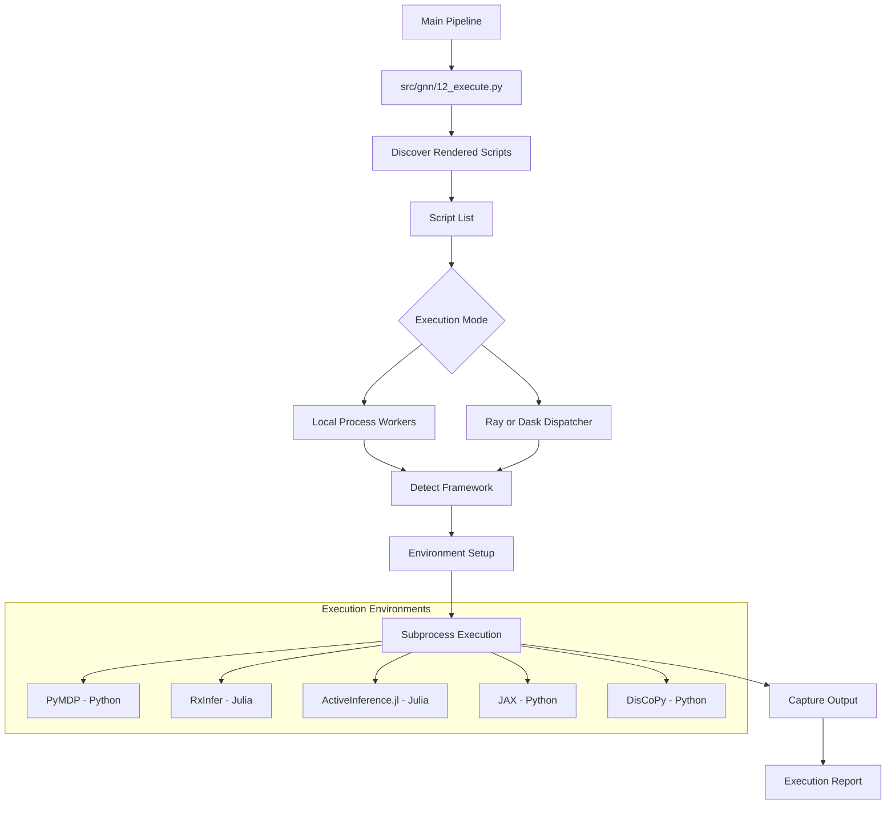

# Execute Module

This module is responsible for running GNN models that have been rendered into framework-specific simulation code by Step 11 (`src/gnn/11_render.py`).

## Supported Frameworks

| Framework | Language | Subfolder | Script Pattern | Status |
|-----------|----------|-----------|----------------|--------|
| **PyMDP** | Python | `pymdp/` | `*_pymdp.py` | ✅ Full support |
| **RxInfer.jl** | Julia | `rxinfer/` | `*_rxinfer.jl` | ✅ Full support |
| **ActiveInference.jl** | Julia | `activeinference_jl/` | `*_activeinference.jl` | ✅ Full support |
| **JAX** | Python | `jax/` | `*_jax.py` | ✅ Full support |
| **DisCoPy** | Python | `discopy/` | `*_discopy.py` | ✅ Full support |
| **PyTorch** | Python | `pytorch/` | `*_pytorch.py` | ✅ Full support |
| **NumPyro** | Python | `numpyro/` | `*_numpyro.py` | ✅ Full support |
| **Stan** | Python (cmdstanpy driver) | `stan/` | `*_stan.py` | ✅ Full support (requires `uv sync --extra stan` + CmdStan toolchain; skipped otherwise) |
| **THRML** | Python/JAX | `thrml/` | `*_thrml.py` | Experimental categorical Gibbs smoothing; explicit `thrml` extra and selection; fresh sample/result binding |
| **cpomdp** | Python/JAX | `cpomdp/` | `*_cpomdp.py` | Experimental continuous inference/control; explicit `cpomdp` extra and selection |
| **ngc-learn** | Python/JAX | `ngclearn/` | `*_ngclearn.py` | Continuous predictive processing; Python >=3.12 optional runtime |
| **Lean 4** | Lean (fep_lean bridge) | `lean/` | `*.lean` + emitted `*.md` | ✅ Full support (requires the fep_lean checkout via `FEP_LEAN_ROOT`; skipped otherwise) |
| **bnlearn** | Python (generator-backed; `.R` lane via Rscript) | `bnlearn/` | `*_bnlearn.py`, `*.R` | ✅ Full support (requires the `bnlearn` extra or R + R `bnlearn` package; skipped otherwise) |
JAX, NumPyro, PyTorch, and DisCoPy are **core** dependencies (`uv sync`). If the environment is incomplete, their scripts report an explicit skipped status. Requested Julia frameworks require Julia plus their package set; in strict requested-framework runs, missing packages make Step 12 fail.

## Module Structure

```
src/gnn/execute/
├── __init__.py              # Module initialization
├── executor.py              # GNNExecutor class (framework dispatch)
├── processor/               # Step 12 processor package (facade re-exports)
│   ├── __init__.py          # Facade: pre-split module surface, re-exports
│   ├── envelope.py          # Per-script result envelope factories
│   ├── workers.py           # Worker coercion + local process-pool dispatch
│   ├── summary.py           # Aggregate summary assembly, outcome classification, persistence
│   ├── single.py            # Single-script subprocess execution
│   └── pipeline.py          # process_execute orchestration + file-level entry
├── validator.py             # Output validation
├── data_extractors.py       # Result data extraction
├── julia_setup.py           # Julia environment setup
├── pymdp/                   # PyMDP execution
│   └── simulation.py        # PyMDP simulation runner
├── rxinfer/                 # RxInfer.jl execution
├── activeinference_jl/      # ActiveInference.jl execution
├── jax/                     # JAX execution
├── stan/                    # Stan execution (cmdstanpy driver runner)
├── bnlearn/                 # bnlearn execution (generator-backed programs; Python + R lanes)
├── thrml/                   # Experimental categorical sampling with fresh result validation
├── numpyro/                 # NumPyro execution
├── discopy/                 # DisCoPy execution
│   └── discopy_translator_module/
├── lean/                    # Lean verification via the fep_lean bridge
└── mcp.py                   # MCP tool integration
```

## Execution Workflow



## Core Components

### `executor.py` — `GNNExecutor` and framework dispatch

Main executor class plus a small `ExecutorFrameworkSpec` registry for framework-wide dispatch:

- `execute_gnn_model(model_path, execution_type, options)` — Execute a rendered script
- `run_simulation(simulation_config)` — Run a simulation from config
- `generate_execution_report(output_file)` — Generate execution summary
- `_execute_pymdp_script()`, `_execute_rxinfer_config()`, `_execute_discopy_diagram()`, `_execute_jax_script()`, `_execute_numpyro_script()`, `_execute_pytorch_script()`, `_execute_ngclearn_script()`, `_execute_activeinference_script()`, `_execute_stan_script()`, `_execute_bnlearn_script()`, `_execute_lean_verification()` — Framework-specific execution methods (the standard registry includes implemented bnlearn execution; optional runtimes retain explicit skip receipts. Experimental cpomdp requires explicit selection)
- `execute_rendered_simulators(...)` — Iterates the registry, writes `summaries/execution_summary.json`, and renders the markdown execution report (`summaries/execution_report.md`)
- `list_frameworks()` — Explicit live readiness introspection: one record per backend with `framework`, `result_key`, `available`, `operation`, and a structured `readiness` diagnosis.

Registry metadata and summary counting use `_framework_specs(resolve_availability=False)`
and never probe optional runtimes. The batch executor discovers candidates once
and probes only their frameworks. Probe failures and cleanup uncertainty are
failed work; missing prerequisites are visible skips. Nonempty required scripts
that all skip or produce no execution records make batch acceptance false.
An empty render tree remains valid zero work.

### `processor/` — Step 12 Entry Point (package facade)

Orchestrates multi-framework execution:

1. Discovers all rendered scripts in `output/11_render_output/`
2. Detects framework by file extension and naming pattern
3. Executes each script in the appropriate runtime environment, serially by default or with bounded script-level workers
4. Aggregates results into `output/12_execute_output/summaries/`


### `planning.py` — Dry-run Step 12 planning

`plan_execute(target_dir, output_dir, frameworks="all", **config) -> ExecutionPlan` composes the same discovery / render-contract / dependency primitives as `process_execute` but runs **no rendered model scripts** and uses bounded package readiness probes, including the committed Julia projects. It returns a typed `ExecutionPlan` (defined in `types.py`) describing which rendered scripts would run, which would be skipped because their backend dependency is absent, and which the render-summary contract references but cannot discover on disk — for preflight checks, CI gates, and interactive debugging.


### `pymdp/simulation.py`

PyMDP simulation runner with:

- 2D and 3D B matrices (passive models and action-conditioned)
- Column normalization for stochastic matrices
- Strict `pymdp_simulation_v1` `simulation_results.json` output

### Julia framework scripts

RxInfer.jl and ActiveInference.jl generated scripts write current JSON schemas:

- `rxinfer_simulation_v1`
- `activeinference_jl_simulation_v1`

Both schemas include observations by modality, hidden states by factor, actions by control factor, beliefs by factor, expected free energy, policy posterior, validation, matrix provenance, and runtime metadata.

RxInfer.jl runs the genuine `@model` + `infer()` pipeline under the committed
`Project.toml` + `Manifest.toml` at `src/gnn/execute/rxinfer/` (RxInfer 5.5.0). The
runner invokes `julia --startup-file=no --project=src/gnn/execute/rxinfer <script>`;
`setup_environment.jl` activates + instantiates the environment (no runtime
`Pkg.add`). `rxinfer_simulation_v1` carries a genuine `variational_free_energy`
trace (previously `Float64[]`) and records the seed + script SHA256
(`uses_real_rxinfer: true`) in `runtime_metadata`.

### `julia_setup.py`

Julia environment management helpers for RxInfer.jl and ActiveInference.jl.

## Current Cross-Framework Gate

```bash
uv run --extra dev python -m pytest tests/pipeline/test_pomdp_gridworld_cross_framework.py -q --tb=short
```

## Usage

### From Pipeline

```bash
# Run as part of full pipeline
python src/gnn/main.py

# Run only render + execute steps  
python src/gnn/main.py --only-steps "11,12"

# Execute rendered scripts with two local workers
python src/gnn/main.py --only-steps "11,12" --execution-workers 2
```

### Standalone

```python
from gnn.execute.executor import GNNExecutor

executor = GNNExecutor(output_dir="output/12_execute_output")
result = executor.execute_gnn_model("path/to/script.py", execution_type="pymdp")
```

---

## Documentation

- **[README](README.md)**: Module Overview
- **[AGENTS](AGENTS.md)**: Agentic Workflows
- **[SPEC](SPEC.md)**: Architectural Specification
- **[SKILL](SKILL.md)**: Capability API


### Current execution receipts

Step 12 verifies source and artifact SHA-256 digests when consuming identified
Step 11 receipts. A mismatched run ID or changed source/script cannot authorize
execution. Receipts without identities are accepted only when no explicit run ID is
required; they provide no freshness proof.

Execution inputs and scripts are fingerprinted before dispatch and checked again
before publication. `summaries/execution_summary.json` is replaced atomically;
previous receipts are retained separately under `summaries/history/`.
`invocation_receipts` contains current scope records for the same run and
configuration. Retrying a scope replaces its verdict and script set; counters,
framework statuses, and aggregate status are recomputed. `current_invocation`
retains the current call's verdict separately from the aggregate.

Absent that identity, standalone calls start a fresh receipt rather than adopt
previous-run results. bnlearn executes through `execute/bnlearn/` and the
shared pre-flight probe; without its runtime the scripts are reported
skipped. Optional dependency absence is reported as skipped, and explicitly
requested unavailable frameworks follow the strict execution policy.

Distributed collection keeps one ordered receipt per submitted script. A task
error or cancellation preserves successful siblings, and recoverable Dask
`lost` state remains pending until recovery or the deadline. Scheduler readiness
does not permit an unbounded result transfer: each Dask `Future.result` and Ray
`get` uses a short fair slice of the same monotonic budget. The backend wait
limit (`GNN_DISTRIBUTED_WAIT_TIMEOUT`, default 7200 seconds) is intersected with
the invocation deadline. Timeout receipts name the effective budget and retain
model, framework, and script identity when published by Step 12.

At expiry, cancellation is a request, not evidence that remote work stopped.
Owned Dask clients and local clusters are closed separately, with cleanup waits
bounded by the remaining invocation budget; exhausted budgets queue public
asynchronous close requests. A preexisting Ray runtime belongs to its caller.
Pipeline subprocess supervision supplies the hard process boundary, including
backend startup and Ray shutdown. Direct `Dispatcher` calls require a ready
caller-owned Dask client (`Dispatcher("dask", client=client)`) or an initialized
Ray runtime. Initialization failure returns typed per-submission failures and
never executes an unbounded sequential fallback. Cancellation and asynchronous
close requests remain advisory until the supervising process verifies shutdown.

The shared subprocess envelope tracks descendants while the child is alive,
including observed children that detach into a new session. Every exit path
shares a one-second allowance for termination, reaping, and output draining.
The receipt exposes `containment`, `cleanup_verified`, and `streams_drained`;
incomplete observation or inherited pipes that stay open fail with
`ProcessCleanupFailure`, preserving partial output and any earlier timeout or
cancellation as `execution_error_type`. This observation boundary does not
certify containment of a process that detaches before observation. On native
macOS and Linux, process-table scans and process groups provide this bounded
observation boundary; hostile or sufficiently fast daemonization requires an
operating-system sandbox. `observed_descendant_count` records how many process
identities were retained and does not prove that no other descendants existed.

Optional backend acceptance uses real LocalCluster and isolated Ray processes:

```bash
uv run --extra dev --extra scaling python -m pytest tests/execute/test_distributed_collection.py -q --tb=short
```


THRML direct and batch execution APIs are documented in
[the THRML execution contract](thrml/SPEC.md). Generic Step 12 uses the same
scientific validator and execution-ID/script-SHA binding. It keeps native results
in the current implementation directory rather than collecting historical files
from render directories. `GNNExecutor.execute_gnn_model(..., execution_type="thrml")`
uses the maintained supervised runner.
